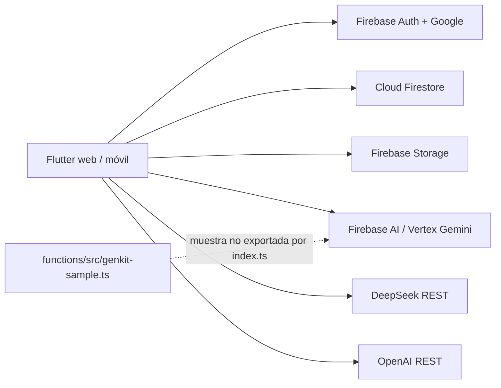
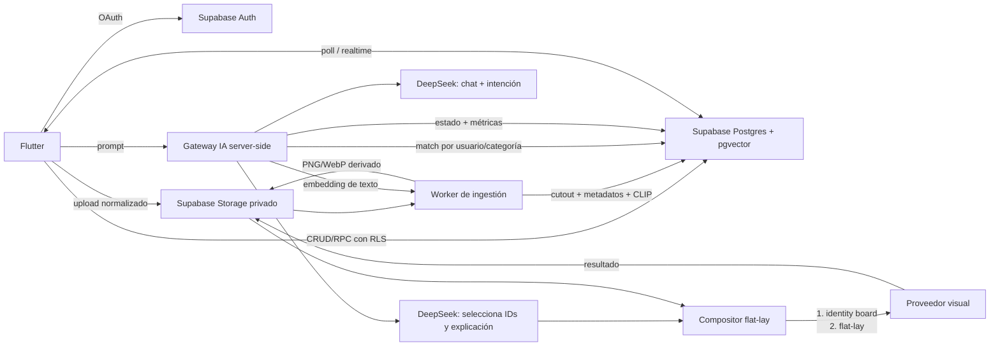

# Auditoría arquitectural y plan de migración de AIFit

**Fecha de corte:** 19 de septiembre de 2026  
**Alcance:** repositorio `AI-Fit`, aplicación Flutter, configuración Firebase, reglas, Cloud Functions y pipeline de IA.  
**Método:** inspección estática de solo lectura del repositorio y trazado del grafo de código. No se consultaron datos de producción, métricas de Firebase/Vertex, facturas, tamaños reales de imágenes ni configuraciones desplegadas. Las cifras de costo son escenarios reproducibles, no una factura observada.

## Resumen ejecutivo

AIFit no necesita una reescritura total. Ya contiene tres piezas útiles que deben conservarse: compresión de imágenes de prendas, caché de bytes por sesión y scoring semántico determinista. El problema principal es que esas piezas no eliminan la llamada multimodal más redundante: para crear tres propuestas, `OutfitGeneratorService` descarga y vuelve a enviar hasta 12 fotos de prendas a Gemini aunque Firestore ya guarda color, estilo, silueta, ocasión, clima y otros metadatos por prenda.

El pipeline actual tiene cuatro riesgos P0/P1:

1. **Una clave real de DeepSeek está versionada y se envía dentro del bundle Flutter.** Toda clave puesta en Dart cliente debe considerarse pública. Debe rotarse y moverse a un secreto de servidor antes de ampliar tráfico.
2. **Las llamadas a DeepSeek, OpenAI y Gemini ocurren desde el cliente.** No hay rate limiting central, idempotencia, presupuesto por usuario, telemetría de costo completa ni capacidad segura de cambiar proveedores.
3. **`gemini-2.5-flash-image` está en dos rutas críticas y Google anuncia su retiro el 2 de octubre de 2026.** A la fecha de esta auditoría el cutover de imagen es urgente.
4. **La regla `allow list: if signedIn()` de `wardrobe_items` permite que cualquier usuario autenticado intente listar la colección global.** La aplicación filtra por `userId`, pero la regla no impone ese propietario. Debe cerrarse de inmediato.

La arquitectura recomendada usa Supabase Auth/Postgres/Storage como sistema de registro, una función de servidor pequeña como gateway de IA, DeepSeek para chat, intención y composición textual, `pgvector` para recuperar candidatos, y un proveedor visual intercambiable para el try-on. Cada prenda se analiza y embebe una sola vez al subirla. Para cada look se envían exactamente dos imágenes al generador visual: una tabla de identidad del usuario y un flat-lay determinista con las prendas seleccionadas.

La migración a Supabase no garantiza por sí sola menor costo fijo. Supabase asigna una instancia Postgres por proyecto; su plan de pago tiene un piso de cómputo. La decisión debe compararse con la factura real de Firebase. Sí aporta un modelo relacional más adecuado, joins, RLS, `pgvector` y una sola capa para datos, objetos y búsqueda vectorial.

## 1. Diagnóstico del estado actual

### 1.1 Topología observada

No existe un backend de aplicación activo en este repositorio. Flutter habla directamente con Firebase y con proveedores de IA.



`functions/src/index.ts` no exporta ninguna función. `functions/src/genkit-sample.ts` define un ejemplo `menuSuggestionFlow` de restaurante que no pertenece al producto y no está conectado al flujo Flutter. Por tanto, hoy no protege claves ni orquesta inferencia.

### 1.2 Mapa de archivos, responsabilidades e integraciones

| Área | Archivo | Responsabilidad actual | Proveedor / efecto |
|---|---|---|---|
| Bootstrap | `lib/main.dart` | Inicializa Firebase, repositorios y BLoCs | Firebase Core |
| Configuración | `lib/firebase_options.dart`, archivos `GoogleService-Info.plist` y `google-services.json` | Identificadores públicos del proyecto Firebase | Firebase |
| Secretos | `lib/api_keys.dart` | Claves DeepSeek/OpenAI compiladas en el cliente | Riesgo crítico; OpenAI está vacío, DeepSeek no |
| Auth | `lib/features/auth/data/auth_repository.dart` | Google popup/web, Google native, Firebase credential, sincronización de `users` | Firebase Auth + Firestore |
| DB | `lib/core/services/firestore_service.dart` | Singleton hacia la base nombrada `aifitdbex` | Firestore |
| Storage | `lib/core/services/storage_service.dart` | Fotos, prendas, imagen base y try-ons | Firebase Storage |
| Perfil | `lib/features/profile/data/profile_repository.dart` | Fotos de rostro/cuerpo, preferencias, onboarding y borrado parcial | Firestore + Storage |
| Identidad | `lib/features/profile/services/user_identity_analysis_service.dart` | Descarga fotos, crea collage, analiza identidad y lo persiste | Gemini 2.5 Pro vía `FirebaseAIServiceImpl` |
| Imagen base | `lib/features/outfit/services/user_base_image_service.dart` | Genera y reutiliza una imagen neutral del usuario | Gemini 2.5 Flash Image |
| Armario | `lib/features/wardrobe/data/wardrobe_repository_impl.dart` | CRUD y análisis visual de cada prenda | Firestore, Storage, Gemini 2.5 Flash |
| Intención | `lib/features/outfit/services/outfit_intent_analyzer.dart` | Convierte prompt a JSON | DeepSeek; fallback Gemini; fallback local |
| Chat | `lib/features/stylist/services/stylist_chat_service.dart` | Conversación y estado de intención | OpenAI `gpt-4.1-mini`; actualmente falla si la clave sigue vacía |
| Filtro | `lib/features/outfit/services/wardrobe_search_algorithm.dart` | Filtra/rankea por campos y metadatos | Local, sin costo de inferencia |
| Scoring | `lib/features/outfit/services/wardrobe_metadata_scorer.dart` | Puntúa ocasión, estética, clima y color | Local, sin costo de inferencia |
| Composición | `lib/features/outfit/services/outfit_generator_service.dart` | Envía hasta 12 imágenes y crea tres outfits JSON | Gemini 2.5 Flash multimodal |
| Orquestación | `lib/features/outfit/services/outfit_service.dart` | Intención → armario → filtro → outfits → try-on | Cliente; Firestore + varias IA |
| Try-on | `lib/features/outfit/services/virtual_try_on_service.dart` | Descarga base/rostro/prendas, genera imagen y la sube | Gemini 2.5 Flash Image + Storage |
| Lookbook | `lib/features/outfit/data/saved_outfits_repository.dart` | CRUD, filtros, mezcla Firestore/Storage y backfill | Firestore + listados de Storage |
| Payload | `lib/core/utils/image_compression_util.dart` | JPEG de prenda a ancho 768; identidad con regla defectuosa | Cliente |
| Caché | `lib/core/services/image_byte_cache.dart` | Mapas en memoria de bytes originales y comprimidos | Sesión del cliente, sin límite |
| Collage | `lib/core/utils/identity_photo_collage.dart` | Cuatro filas de referencias de identidad | Cliente |
| Seguridad | `firestore.rules`, `storage.rules` | Autorización por propietario | Firebase Rules |
| Índices | `firestore.indexes.json` | Dos índices `userId + createdAt` | Firestore |
| Hosting | `firebase.json` | Hosting SPA y caché de assets compilados | Firebase Hosting |

### 1.3 Flujo real de inferencia

#### Alta de una prenda

1. `AppImage.fromXFile` carga el archivo completo en memoria.
2. `StorageService.uploadWardrobeItem` sube los bytes originales sin redimensionar.
3. `WardrobeRepositoryImpl` envía la misma prenda a `FirebaseAIServiceImpl.analyzeImageToJson`.
4. El cliente comprime a JPEG, ancho máximo 768, y llama Gemini 2.5 Flash.
5. Firestore guarda datos visibles y, según la ruta, metadatos semánticos v2.

Cada prenda paga análisis visual al menos una vez. Esa parte es razonable si el resultado se reutiliza, pero hoy no produce un embedding y no evita que la imagen vuelva a analizarse al generar outfits.

#### Generación de propuestas

1. `OutfitIntentAnalyzer` intenta DeepSeek desde el dispositivo.
2. Descarga todos los documentos `wardrobe_items` del usuario.
3. `WardrobeSearchAlgorithm` filtra y puntúa localmente.
4. `OutfitGeneratorService` concatena tops, bottoms, shoes y outerwear, toma los primeros 12, descarga sus imágenes y las envía a Gemini 2.5 Flash junto con metadatos que ya describen esas imágenes.
5. Gemini devuelve tres combinaciones JSON.
6. `OutfitService` persiste en background sin esperar el resultado.

Hay una falla de selección: como la lista se concatena por categoría y luego hace `take(12)`, diez tops y dos bottoms pueden ocupar el cupo completo; los zapatos quedan descritos en texto pero sin imagen. También se paga visión por información ya persistida.

#### Try-on

1. Busca una imagen base generada previamente; si no existe, usa foto corporal.
2. Descarga siempre una foto de rostro adicional cuando está disponible.
3. Descarga y comprime cada prenda por separado.
4. Envía base/cuerpo + rostro + N prendas + prompt a `gemini-2.5-flash-image`.
5. Recibe bytes, los sube a Storage y actualiza el outfit en Firestore.

Una combinación típica de top, bottom y zapatos usa cinco entradas visuales: base, rostro y tres prendas. Con outerwear usa seis. El objetivo de dos entradas todavía no existe.

#### Imagen base e identidad

Las fotos de rostro/cuerpo se convierten en collage; Gemini 2.5 Pro crea un perfil JSON y Gemini 2.5 Flash Image crea una foto neutral. El resultado se cachea por usuario. Esta amortización es correcta, pero no hay versionado por hash de fotos: si cambia una foto, la invalidación depende de acciones explícitas y puede quedar una base vieja.

### 1.4 Colecciones y esquema implícito de Firestore

#### `users/{firebaseUid}`

Campos observados: `displayName`, `email`, `photoUrl`, `createdAt`, `lastLogin`, `updatedAt`, `preferences`, `bodyPhotos[]`, `facePhotos[]`, `onboardingCompleted`, `identityProfile` JSON, `identityVersion`, `identityCollageUrl`, `identityGeneratedAt`, `baseImageUrl`, `baseImageGeneratedAt`.

Problemas:

- URLs de múltiples objetos se incrustan en arrays, por lo que no hay entidad foto, checksum, dimensiones, estado, orden ni borrado transaccional.
- Datos biométricos derivados y perfil general viven en el mismo documento.
- El borrado de cuenta no borra el usuario de Firebase Auth, `saved_outfits`, imágenes de armario, collages, bases ni try-ons.

#### `wardrobe_items/{itemId}`

Campos observados: `userId`, `imageUrl`, `name`, `type`, `subType`, `colors[]`, `brand`, `styleTags[]`, `season[]`, `createdAt`, `updatedAt` y metadatos IA embebidos: `ai_schema_version`, `visual_weight`, `texture`, `silhouette`, `fashion_aesthetic`, `color_profile`, `style_scores`, `gender_expression`, `layering_compatibility`, `occasion_vectors`, `climate_compatibility`, `visual_attributes`.

Problemas:

- No hay `content_hash`, versión de modelo, estado de procesamiento ni embedding.
- `updateWardrobeItem` no vuelve a escribir `userId`; la regla de actualización tampoco impide cambiarlo expresamente.
- La consulta principal trae todo el armario y filtra en el cliente.
- Las excepciones se convierten en lista vacía, haciendo indistinguible “armario vacío” de “falló la base”.

#### `saved_outfits/{outfitId}`

Campos observados: `userId`, `tryOnImageUrl`, `outfit` JSON, `intent` JSON, `colors[]`, `styleTags[]`, `occasion`, `season`, `weather`, `matchPercentage`, `compatibilityScore`, `userPrompt`, `reasoning`, `createdAt`, `lastViewedAt`, `viewCount`, `isFavorite`, `customTags[]`, `notes`.

Problemas:

- Los IDs devueltos por prompt son `outfit_1`, `outfit_2`, `outfit_3`. Como se usan directamente como ID global del documento, una generación posterior puede sobrescribir la anterior y también colisionar entre usuarios.
- Prendas relacionadas se guardan dentro de JSON; no hay FK ni protección ante borrado.
- `incrementViewCount` hace read-modify-write y pierde incrementos concurrentes.
- Los filtros por colores y estilo ocurren en memoria.
- Cada carga sin filtros hace `listAll()` de objetos y luego `getDownloadURL()` serial para cada try-on. Después intenta escribir documentos de backfill. Una lectura de pantalla puede producir muchas operaciones y escrituras.
- El nombre `tryon_<timestamp>.jpg` no contiene `outfitId` ni `generationId`; la reconciliación depende de URL y heurísticas.

### 1.5 Objetos de Storage

| Tipo | Ruta actual | Observación |
|---|---|---|
| Fotos de identidad | `users/{uid}/photos/{body|face}_{timestamp}.jpg` | Se suben bytes originales pero se declaran JPEG |
| Prenda | `users/{uid}/wardrobe/item_{timestamp}.jpg` | Sin hash, tamaño, versión ni derivado optimizado |
| Collage identidad | `users/{uid}/identity_collage_{timestamp}.jpg` | Lo sube un servicio distinto, sin metadata uniforme |
| Imagen base | `users/{uid}/base_image_{timestamp}.jpg` | Versionada por timestamp; Firestore apunta a una sola |
| Try-on | `users/{uid}/outfits/tryon_{timestamp}.jpg` | No está vinculado en el nombre al outfit |

`StorageService` fuerza `contentType: image/jpeg` aunque `image_picker` puede entregar PNG/HEIC y la carga a Storage no transcodifica. Esto puede producir contenido y MIME inconsistentes. Las rutas con timestamp permiten duplicados y objetos huérfanos.

### 1.6 Auth y permisos

- El producto usa Google Sign-In sobre Firebase Auth en web y plataformas nativas.
- Los documentos `users` usan el UID de Firebase como ID.
- `storage.rules` limita `users/{uid}/...` al propietario; esta parte es coherente.
- `firestore.rules` protege documentos individuales, pero `wardrobe_items` tiene `allow list: if signedIn()`. Debe exigir una consulta limitada al UID o cambiar el modelo de datos.
- No se observa App Check aplicado a inferencia. El ejemplo de Cloud Functions lo deja comentado.
- Las cuatro categorías de seguridad de Gemini se configuran con umbral `none` en generación de imagen y outfit. Debe existir una decisión de producto y legal explícita; el default seguro es mantener filtros del proveedor y registrar bloqueos sin imágenes sensibles.
- Firebase API keys presentes en `firebase_options.dart` identifican al proyecto y normalmente se distribuyen en apps cliente; deben tener restricciones de API/origen. La clave de DeepSeek sí es un secreto facturable y está comprometida por diseño.

### 1.7 Fugas de costo, payload y latencia

| Prioridad | Hallazgo | Impacto |
|---|---|---|
| P0 | Clave DeepSeek en `lib/api_keys.dart` | Uso no autorizado y facturación externa |
| P0 | `gemini-2.5-flash-image` próximo a retiro | Interrupción del try-on e imagen base |
| P0 | Listado de armario autorizado para cualquier usuario autenticado | Exposición de metadatos/URLs si una consulta no filtra bien |
| P1 | Hasta 12 imágenes vuelven a Gemini para escoger IDs | Tokens visuales, descargas y latencia evitables |
| P1 | API de IA llamada desde Flutter | Sin cuotas, idempotencia, control de proveedor ni observabilidad central |
| P1 | Subida de fotos/prendas sin compresión previa | Storage y egress innecesarios; mayor tiempo de carga |
| P1 | Identidad solo se amplía si es pequeña; nunca se reduce si es enorme | Payloads de identidad sin techo y posible OOM/jank |
| P1 | La imagen base se envía cruda al try-on | Doble descarga y payload potencialmente grande |
| P1 | Persistencia `unawaited` | Resultados perdidos al cerrar/suspender app |
| P1 | IDs `outfit_1..3` globales | Sobrescritura entre generaciones/usuarios |
| P1 | Lookbook enumera Storage y repara DB durante lectura | Operaciones O(n), egress y escrituras inesperadas |
| P2 | Caché en memoria sin límite/TTL | Presión de memoria en armarios grandes |
| P2 | Fallback de URLs hace una lectura por prenda | N+1 si no llega el mapa precargado |
| P2 | Compresión siempre JPEG | Pierde alfa de prendas; obliga a segmentar otra vez |
| P2 | `firebase_messaging`, `get_it`, `uuid` y `path_provider` no tienen uso productivo visible | Dependencias y superficie de mantenimiento |
| P2 | Cloud Functions contiene una muestra Genkit no conectada | Dependencias Node/Genkit sin valor de producto |

La compresión actual ocurre después de subir el original a Storage. Por ello reduce parte del costo de IA, pero no el costo de upload/almacenamiento ni las descargas posteriores. Además, si `decodeImage` falla, el método devuelve bytes originales y el caller los etiqueta como JPEG.

## 2. Arquitectura objetivo (To-Be)

### 2.1 Principios

1. El cliente nunca contiene secretos de proveedores.
2. Cada imagen se normaliza, analiza y embebe una vez; las solicitudes reutilizan esos artefactos.
3. DeepSeek solo razona sobre texto/JSON y IDs. El modelo visual solo genera o edita píxeles.
4. Storage guarda rutas privadas y versionadas; la base no persiste URLs firmadas.
5. Postgres aplica RLS en todas las tablas públicas y FKs/cascadas donde corresponde.
6. El proveedor de imagen se selecciona por benchmark de fidelidad, no solo por precio anunciado.
7. Cada generación tiene ID, estado, idempotency key, modelo, latencia y costo estimado.

### 2.2 Flujo objetivo



Secuencia por generación:

1. DeepSeek normaliza la petición a `OutfitIntent`.
2. El mismo texto normalizado se convierte a embedding CLIP de texto.
3. Postgres recupera candidatos del usuario por categoría, filtros duros y similitud; para armarios pequeños usa distancia exacta.
4. DeepSeek recibe solo los 12–24 candidatos en JSON compacto y devuelve tres combinaciones de IDs.
5. Solo cuando el usuario pide visualizar un look, el compositor crea el flat-lay de sus 3–4 prendas.
6. El proveedor visual recibe dos imágenes y un prompt versionado.
7. El gateway guarda resultado, costo, latencia, modelo y fallo normalizado.

### 2.3 Frontera de servicios recomendada

**Supabase Edge Function `ai-router`:** valida JWT, aplica cuota/idempotencia, llama DeepSeek y al proveedor visual, y persiste estados. Usa `fetch` nativo; no necesita un framework.

**Cloud Run `image-worker`:** un contenedor Python con endpoints internos para normalización/segmentación, CLIP y flat-lay. Se despliega con mínimo de instancias 0 al inicio. Se justifica porque Edge Functions no es el lugar adecuado para pesos ONNX/PyTorch grandes. Si el volumen es bajo, se puede sustituir temporalmente por una API de embeddings/segmentación, manteniendo el contrato.

No se recomienda exponer Cloud Run al cliente. `ai-router` usa una identidad de servicio o token firmado y límites estrictos.

### 2.4 Esquema relacional propuesto

El DDL siguiente es el esquema final con Supabase Auth. `legacy_firebase_uid` conserva trazabilidad durante importación. La dimensión `512` asume CLIP ViT-B/32; cambiar de modelo exige una nueva columna o tabla/versionado, no mezclar vectores de dimensiones/modelos distintos.

```sql
create extension if not exists pgcrypto;
create extension if not exists vector with schema extensions;

create table public.profiles (
  id uuid primary key references auth.users(id) on delete cascade,
  legacy_firebase_uid text unique,
  display_name text not null default '',
  avatar_path text,
  preferences jsonb not null default '{}'::jsonb,
  onboarding_completed boolean not null default false,
  identity_profile jsonb,
  identity_version integer,
  identity_collage_path text,
  identity_content_hash text,
  base_image_path text,
  base_image_content_hash text,
  created_at timestamptz not null default now(),
  updated_at timestamptz not null default now()
);

create table public.user_photos (
  id uuid primary key default gen_random_uuid(),
  user_id uuid not null references public.profiles(id) on delete cascade,
  kind text not null check (kind in ('face', 'body')),
  storage_path text not null unique,
  content_hash text not null,
  width integer check (width > 0),
  height integer check (height > 0),
  bytes integer check (bytes > 0),
  position smallint not null default 0,
  created_at timestamptz not null default now(),
  unique (user_id, kind, content_hash)
);

create table public.wardrobe_items (
  id uuid primary key default gen_random_uuid(),
  user_id uuid not null references public.profiles(id) on delete cascade,
  legacy_firestore_id text,
  name text not null,
  category text not null check (category in ('top', 'bottom', 'shoes', 'outerwear')),
  subtype text not null,
  brand text,
  source_path text not null,
  cutout_path text,
  content_hash text not null,
  colors text[] not null default '{}',
  style_tags text[] not null default '{}',
  seasons text[] not null default '{}',
  ai_metadata jsonb not null default '{}'::jsonb,
  embedding extensions.vector(512),
  embedding_model text,
  processing_status text not null default 'pending'
    check (processing_status in ('pending', 'processing', 'ready', 'failed')),
  processing_error text,
  created_at timestamptz not null default now(),
  updated_at timestamptz not null default now(),
  unique (user_id, legacy_firestore_id),
  unique (user_id, content_hash)
);

create index wardrobe_items_owner_category_idx
  on public.wardrobe_items (user_id, category, created_at desc);
create index wardrobe_items_colors_gin
  on public.wardrobe_items using gin (colors);
create index wardrobe_items_style_tags_gin
  on public.wardrobe_items using gin (style_tags);

create table public.outfit_generations (
  id uuid primary key default gen_random_uuid(),
  user_id uuid not null references public.profiles(id) on delete cascade,
  idempotency_key text not null,
  user_prompt text not null,
  intent jsonb not null,
  status text not null default 'pending'
    check (status in ('pending', 'selecting', 'ready', 'rendering', 'completed', 'failed')),
  text_provider text,
  text_model text,
  image_provider text,
  image_model text,
  input_tokens bigint not null default 0,
  output_tokens bigint not null default 0,
  estimated_cost_usd numeric(12, 6) not null default 0,
  latency_ms integer,
  error_code text,
  created_at timestamptz not null default now(),
  updated_at timestamptz not null default now(),
  unique (user_id, idempotency_key)
);

create table public.outfits (
  id uuid primary key default gen_random_uuid(),
  generation_id uuid not null references public.outfit_generations(id) on delete cascade,
  user_id uuid not null references public.profiles(id) on delete cascade,
  rank smallint not null check (rank between 1 and 10),
  match_percentage smallint not null default 0 check (match_percentage between 0 and 100),
  compatibility_score real not null default 0 check (compatibility_score between 0 and 1),
  explanation text not null default '',
  explanation_es text not null default '',
  try_on_path text,
  flat_lay_path text,
  is_favorite boolean not null default false,
  custom_tags text[] not null default '{}',
  notes text,
  view_count bigint not null default 0,
  last_viewed_at timestamptz,
  created_at timestamptz not null default now(),
  unique (generation_id, rank)
);

create index outfits_owner_created_idx
  on public.outfits (user_id, created_at desc);
create index outfits_owner_favorite_idx
  on public.outfits (user_id, is_favorite, created_at desc);

create table public.outfit_items (
  outfit_id uuid not null references public.outfits(id) on delete cascade,
  wardrobe_item_id uuid not null references public.wardrobe_items(id) on delete restrict,
  role text not null check (role in ('top', 'bottom', 'shoes', 'outerwear')),
  primary key (outfit_id, role),
  unique (outfit_id, wardrobe_item_id)
);

alter table public.profiles enable row level security;
alter table public.user_photos enable row level security;
alter table public.wardrobe_items enable row level security;
alter table public.outfit_generations enable row level security;
alter table public.outfits enable row level security;
alter table public.outfit_items enable row level security;

create policy profiles_owner_all on public.profiles
  for all to authenticated using (id = (select auth.uid()))
  with check (id = (select auth.uid()));
create policy photos_owner_all on public.user_photos
  for all to authenticated using (user_id = (select auth.uid()))
  with check (user_id = (select auth.uid()));
create policy wardrobe_owner_all on public.wardrobe_items
  for all to authenticated using (user_id = (select auth.uid()))
  with check (user_id = (select auth.uid()));
create policy generations_owner_all on public.outfit_generations
  for all to authenticated using (user_id = (select auth.uid()))
  with check (user_id = (select auth.uid()));
create policy outfits_owner_all on public.outfits
  for all to authenticated using (user_id = (select auth.uid()))
  with check (user_id = (select auth.uid()));
create policy outfit_items_owner_select on public.outfit_items
  for select to authenticated using (
    exists (
      select 1 from public.outfits o
      where o.id = outfit_id and o.user_id = (select auth.uid())
    )
  );
```

Las escrituras de `outfit_items` deben pasar por una RPC transaccional o por el gateway con service role, validando que outfit y prenda tengan el mismo `user_id`. No se debe entregar `service_role` al cliente.

Función mínima para matching. Para un armario individual de decenas o cientos de prendas, el scan exacto es más simple y suele ser más rápido que introducir ANN prematuramente:

```sql
create or replace function public.match_wardrobe(
  query_embedding extensions.vector(512),
  category_filter text,
  match_count integer default 12
)
returns table (
  id uuid,
  category text,
  similarity real,
  metadata jsonb
)
language sql
stable
security invoker
set search_path = public, extensions
as $$
  select w.id,
         w.category,
         (1 - (w.embedding <=> query_embedding))::real,
         jsonb_build_object(
           'name', w.name,
           'subtype', w.subtype,
           'colors', w.colors,
           'styleTags', w.style_tags,
           'ai', w.ai_metadata
         )
  from public.wardrobe_items w
  where w.user_id = (select auth.uid())
    and w.processing_status = 'ready'
    and w.embedding is not null
    and (category_filter is null or w.category = category_filter)
  order by w.embedding <=> query_embedding
  limit least(greatest(match_count, 1), 50);
$$;
```

Agregar HNSW solo cuando una medición muestre que el scan exacto es un cuello de botella. El índice global puede tener mala recuperación si el filtro por usuario se aplica después del ANN; particionar o combinar filtros requiere pruebas con cardinalidad real.

### 2.5 Supabase Storage

Buckets privados propuestos:

- `user-media`: originales normalizados, fotos, prendas y cutouts.
- `generated`: collages, identity boards, flat-lays y try-ons.

Rutas deterministas:

```text
user-media/{user_uuid}/photos/{photo_uuid}.jpg
user-media/{user_uuid}/wardrobe/{item_uuid}/source.webp
user-media/{user_uuid}/wardrobe/{item_uuid}/cutout.webp
generated/{user_uuid}/identity/{content_hash}.jpg
generated/{user_uuid}/flatlays/{outfit_uuid}.jpg
generated/{user_uuid}/tryons/{outfit_uuid}/{attempt_uuid}.webp
```

Política base para cada bucket:

```sql
create policy storage_owner_read on storage.objects
  for select to authenticated
  using ((storage.foldername(name))[1] = (select auth.uid())::text);

create policy storage_owner_insert on storage.objects
  for insert to authenticated
  with check ((storage.foldername(name))[1] = (select auth.uid())::text);

create policy storage_owner_update on storage.objects
  for update to authenticated
  using ((storage.foldername(name))[1] = (select auth.uid())::text)
  with check ((storage.foldername(name))[1] = (select auth.uid())::text);

create policy storage_owner_delete on storage.objects
  for delete to authenticated
  using ((storage.foldername(name))[1] = (select auth.uid())::text);
```

Las consultas deben guardar `storage_path`, no download URLs. El cliente solicita URL firmada corta o descarga autenticada. Los nombres versionados por hash evitan invalidación ambigua; `cacheControl` puede ser largo porque una modificación crea otra ruta.

### 2.6 Migración de identidad

El login actual es Google, lo cual simplifica la migración porque no hay contraseña propia que preservar. Aun así, una sesión Firebase no se convierte en sesión Supabase: se debe planear una reautenticación.

Plan recomendado:

1. Exportar Firebase Auth y construir `firebase_uid → provider subject/email verificado`.
2. Crear usuarios Supabase con la herramienta oficial de migración o hacer que el primer Google OAuth cree la cuenta.
3. Resolver el vínculo por identidad Google verificada; no unir cuentas solo por un email no verificado.
4. Mantener `legacy_firebase_uid` y una tabla temporal de mapping durante la copia de datos.
5. Forzar un nuevo login una sola vez en el cutover; invalidar tokens Firebase después de la ventana de rollback.

Supabase también admite Firebase como proveedor de auth externo para una transición, pero añade claims y políticas dobles. Para este repositorio pequeño, importación + re-login es el camino más corto si producto acepta una sesión cerrada durante el corte.

## 3. Estrategia de optimización de costos de IA

### 3.1 Qué mover a DeepSeek

| Operación | Estado actual | Target |
|---|---|---|
| Conversación de stylist | OpenAI `gpt-4.1-mini`, clave vacía | DeepSeek JSON desde gateway |
| Parsing de intención | DeepSeek cliente + fallback Gemini | DeepSeek servidor + fallback local tipado |
| Selección de combinaciones | Gemini con hasta 12 imágenes | DeepSeek sobre candidatos JSON + reglas locales |
| Explicación ES/EN | Gemini | DeepSeek en la misma respuesta de selección |
| Prompt del try-on/fondo | Template Dart largo | Template versionado de servidor; DeepSeek solo completa atributos variables si hace falta |
| Análisis visual de prenda | Gemini en alta | CLIP + segmentación; visión generativa solo para atributos que CLIP/reglas no cubran |
| Perfil de identidad JSON | Gemini 2.5 Pro | Mantener temporalmente un modelo visual; ejecutar solo al cambiar fotos |
| Imagen base / try-on | Gemini Image | Proveedor visual intercambiable; DeepSeek no aplica |

No se debe usar R1/razonamiento profundo para JSON rutinario. Un modelo chat/flash con salida JSON, temperatura baja y validación de esquema es suficiente. El modelo debe venir de un secreto/configuración de servidor para evitar otro cambio de app cuando el proveedor renombre versiones.

### 3.2 Embeddings y matching

Modelo inicial recomendado: CLIP ViT-B/32 o equivalente de 512 dimensiones. Es barato, conocido y alinea imagen con texto. Procedimiento:

1. Al subir una prenda, normalizar orientación, color y tamaño.
2. Calcular SHA-256 del contenido normalizado. Si `(user_id, content_hash)` existe, reutilizar.
3. Crear cutout y embedding de imagen una sola vez.
4. Persistir `embedding`, `embedding_model`, metadata y estado.
5. En una petición, convertir el intent a una frase canónica por categoría: por ejemplo, `formal warm-weather black minimalist top`.
6. Consultar por usuario y categoría; aplicar primero restricciones duras (`mustAvoid`, tipo, disponibilidad) y después similitud.
7. Pasar a DeepSeek pocos candidatos equilibrados: 4 tops, 4 bottoms, 4 shoes y hasta 3 outerwear, no los primeros 12 de una lista concatenada.

El embedding no sustituye todos los filtros. Color exacto, categoría, temporada y prohibiciones funcionan mejor como columnas/arrays. Vector similarity sirve para estética y lenguaje semántico.

### 3.3 Componente de flat-lay

**Decisión:** preprocesar y segmentar una vez en backend; componer de forma determinista en backend. Un widget de cliente sirve para previsualizar/reordenar, pero no debe ser la fuente canónica porque web/móvil producen diferencias, consumen memoria y obligan a descargar todos los cutouts.

Algoritmo mínimo:

1. En ingestión, leer EXIF y corregir orientación.
2. Convertir a sRGB, limitar el lado largo del original a 1600 px y generar un source WebP/JPEG de calidad 82–86.
3. Segmentar fondo; conservar PNG/WebP con alfa. Rechazar o marcar para revisión si el foreground ocupa menos de 10% o toca demasiados bordes.
4. Recortar al bounding box del alfa con margen de 4%.
5. Para un outfit, crear canvas blanco sRGB de 1024×1024.
6. Usar slots estables: outerwear arriba izquierda, top arriba/centro, bottom abajo izquierda/centro, shoes abajo derecha. Centrar cada prenda con `contain`; nunca deformar.
7. Mantener 48 px de margen y 24 px entre slots; sombra muy leve opcional, sin texto sobre la prenda.
8. Exportar JPEG 85 si no se necesita alfa, con techo de 900 KB; guardar por `outfit_id + hash de item_ids/versiones`.
9. Para identidad, crear un `identity board` único: base 3:4 y, si el benchmark lo requiere, un inset facial de alta resolución dentro del mismo archivo. Así el modelo sigue recibiendo dos inputs.
10. Enviar `identity board + flat-lay`, prompt versionado y seed cuando el proveedor lo permita.

La simple cuadrícula sobre fondo blanco es viable ya con el paquete Dart `image`, pero solo si las fotos de prendas ya tienen fondo uniforme. Sin segmentación, consolidar imágenes reduce el número de inputs pero conserva ruido y puede bajar fidelidad. El benchmark debe comparar ambos modos antes de retirar la ruta actual.

### 3.4 Proveedor visual

No conviene asumir que FLUX genérico es un virtual try-on. La evaluación debe usar el mismo set de 50 casos y medir:

- similitud facial contra referencia;
- similitud CLIP por cada prenda;
- conservación de logotipos/patrones;
- anatomía y oclusiones;
- tasa de bloqueo/fallo;
- p50/p95 de latencia;
- costo completo por resultado aceptado, incluyendo reintentos.

Shortlist:

| Opción | Precio público de referencia | Ventaja | Riesgo |
|---|---:|---|---|
| Gemini 2.5 Flash Image actual | USD 0.039 por salida ≤1024² + inputs | Baseline ya integrado | Retiro anunciado 2026-10-02 |
| Gemini 3.1 Flash Image/Lite Image | Validar al implementar | Migración natural y referencias múltiples | Sigue acoplado a Google; precio/calidad deben medirse |
| fal virtual try-on | USD 0.04 por imagen | Endpoint especializado persona+ropa | Contrato muestra una prenda; flat-lay multi-prenda requiere prueba |
| fal FLUX.1 dev img2img | USD 0.025/MP | Barato y simple | Editor genérico; identidad/garment fidelity inciertas |
| Replicate FLUX Kontext dev | USD 0.025 por imagen | Precio predecible y proveedor alterno | Una imagen de entrada en el contrato observado |
| Cloud Run GPU con VTON open source | Costo por segundo + cold start | Control, privacidad y batching | Operación, pesos, GPU y tuning; no conviene hasta volumen estable |

Fuentes y fecha: [Google Gemini API pricing](https://ai.google.dev/gemini-api/docs/pricing), [Vertex AI pricing](https://cloud.google.com/vertex-ai/generative-ai/pricing), [DeepSeek pricing](https://api-docs.deepseek.com/quick_start/pricing/), [fal virtual try-on](https://fal.ai/models/fal-ai/image-apps-v2/virtual-try-on), [fal FLUX img2img](https://fal.ai/models/fal-ai/flux-1/dev/image-to-image), [Replicate pricing](https://replicate.com/pricing). Los precios cambian; el gateway debe registrar el costo unitario vigente por request.

### 3.5 Estimación por outfit

Unidad comparada: una petición que produce tres propuestas JSON y renderiza **un** try-on de 1024 px. No incluye el costo único de alta de prendas ni almacenamiento mensual.

Supuestos para un rango, porque el repositorio no registra usage metadata:

- Actual: 12 imágenes de prenda en selección; 2 referencias de usuario + 3–4 prendas en try-on.
- Gemini Flash: entrada USD 0.30/M tokens y salida texto USD 2.50/M tokens en la tabla pública consultada.
- Gemini Flash Image: USD 0.039 por imagen de salida ≤1024², más input.
- DeepSeek flash/chat: una llamada de intención y una de selección, 2k–6k tokens totales. El precio depende de versión, hora y cache hit.
- No se atribuye un precio exacto a cada imagen de entrada sin los `usageMetadata` reales.

| Escenario | Texto/selección | Render | Total estimado |
|---|---:|---:|---:|
| Actual, 1 try-on | USD 0.003–0.010 | USD 0.040–0.044 | **USD 0.043–0.054** |
| Target + fal VTO | USD 0.0005–0.003 | USD 0.040 | **USD 0.0405–0.043** |
| Target + FLUX dev 1 MP | USD 0.0005–0.003 | USD 0.025–0.030 | **USD 0.0255–0.033** |
| Target + proveedor premium USD 0.08 | USD 0.0005–0.003 | USD 0.08 | **USD 0.0805–0.083** |

Ahorro probable contra el flujo actual:

- Con VTO de USD 0.04: aproximadamente 0–25%; la mejora fuerte es payload, latencia y control, no el precio de salida.
- Con FLUX de USD 0.025 y calidad aceptable: aproximadamente 25–50%.
- Si se renderizan los tres outfits, multiplicar casi todo el costo visual por tres; la selección bajo demanda ya implementada debe conservarse.
- La imagen base actual agrega ~USD 0.039 una vez por versión de identidad. Amortizada en 20 try-ons equivale a ~USD 0.002 por try-on.

La conclusión estricta es que el generador de imagen domina el costo. Migrar Gemini texto a DeepSeek no produce por sí solo un ahorro grande por outfit. El ahorro sostenible viene de: no reenviar 12 imágenes, evitar regeneraciones/reintentos, renderizar bajo demanda, cachear por hash y escoger un modelo visual que pase el benchmark a menor precio.

### 3.6 Caché y control presupuestal

- **Embeddings:** cache permanente por `content_hash + embedding_model`.
- **Cutouts:** cache permanente por `content_hash + segmentation_model`.
- **Flat-lay:** cache por hash ordenado de `item_id + item_version + layout_version`.
- **Identity board:** cache por hash de fotos + versión del pipeline.
- **Intent:** cache corto por `user_id + normalized_prompt + prompt_version`; evitar cachear conversación ambigua.
- **Try-on:** idempotency key `user_id + outfit_items_hash + identity_hash + prompt_version + model + seed`.
- **Prompts:** constantes versionadas en servidor. Prompt caching del proveedor solo si existe reutilización medida; los prompts actuales son pequeños frente a imágenes.
- **Cuotas:** máximo configurable por usuario/día, una generación activa por outfit e idempotencia obligatoria.
- **Telemetría:** provider, model, request ID, tokens, número/bytes de inputs, latencia, reintentos, costo estimado, código de fallo. Nunca registrar fotos ni prompts sensibles completos.

## 4. Plan de implementación listo para Antigravity / Gemini 3.7 Flash

Cada tarea debe ser un PR pequeño, desplegable y reversible. Antigravity debe respetar los contratos existentes y no crear capas genéricas adicionales.

### Bloqueadores inmediatos (antes de Fase 1)

#### Tarea 0.1 — Cerrar exposición y rotar secreto

**Archivos:** `lib/api_keys.dart`, `.gitignore`, `firestore.rules`, posiblemente configuración CI.  
**Cambios:** rotar DeepSeek; dejar claves IA vacías/eliminar el archivo; cerrar `wardrobe_items` list al propietario; impedir cambio de `userId` en updates; revisar restricciones de Firebase API key.  
**Dependencias:** ninguna.  
**Aceptación:** el bundle compilado no contiene secretos; secret scanner no encuentra proveedores; un usuario A no puede listar/modificar prendas B; la app mantiene login y CRUD propio.

#### Tarea 0.2 — Instrumentación mínima del baseline

**Archivos:** `firebase_ai_service_impl.dart`, `outfit_generator_service.dart`, `virtual_try_on_service.dart`, `user_base_image_service.dart`.  
**Cambios:** registrar `usageMetadata` disponible, tamaños de inputs, duración y outcome con IDs no sensibles.  
**Dependencias:** ninguna.  
**Aceptación:** 30 generaciones de staging producen p50/p95, bytes, tokens, fallos y costo estimable; no se registran URLs firmadas ni imágenes.

### Fase 1 — Supabase DB + Storage

#### 1.1 Crear esquema y RLS

**Crear:** `supabase/migrations/0001_schema.sql`, `0002_rls.sql`, `0003_storage.sql`.  
**Tocar:** ninguno de Flutter todavía.  
**Agregar:** Supabase CLI solo como herramienta de desarrollo.  
**Aceptación:** migraciones aplican desde cero; tests SQL prueban aislamiento A/B, cascadas y constraints; buckets son privados; `service_role` no aparece en cliente.

#### 1.2 Añadir cliente Supabase sin cambiar fuente de datos

**Tocar:** `pubspec.yaml`, `lib/main.dart`.  
**Crear:** `lib/core/services/supabase_client.dart`.  
**Agregar:** `supabase_flutter`.  
**Aceptación:** inicializa por `--dart-define`/config segura; Firebase sigue siendo fuente activa; `flutter analyze` pasa; no hay credenciales de servidor.

#### 1.3 Migrar datos y objetos en staging

**Crear:** `scripts/migrate_firebase_to_supabase.ts` o una sola herramienta equivalente, `scripts/verify_migration.ts`.  
**Leer:** colecciones `users`, `wardrobe_items`, `saved_outfits` y prefijo Storage `users/`.  
**Agregar:** SDKs admin solo bajo `scripts/`, no a Flutter.  
**Algoritmo:** export por páginas; crear mapping UID/IDs; copiar objetos server-to-server; calcular SHA-256; insertar filas transaccionales; reanudar por checkpoint; ejecutar delta final.  
**Aceptación:** conteos por usuario/tipo iguales; bytes y checksums coinciden; 100% de URLs Firestore quedan mapeadas o listadas como error; rerun es idempotente; reporte de huérfanos.

#### 1.4 Cambiar Storage detrás del servicio existente

**Tocar:** `lib/core/services/storage_service.dart`, `lib/core/widgets/app_network_image.dart`, `lib/core/platform/network_image_loader.dart`, `lib/features/profile/services/user_identity_analysis_service.dart`.  
**Cambio mínimo:** conservar firmas públicas de `StorageService` mientras la implementación usa rutas Supabase; reemplazar detección especial de Firebase URL.  
**Aceptación:** upload/download/delete de rostro, cuerpo, prenda, base y try-on funcionan en web/iOS/Android; MIME coincide con bytes; límite de tamaño y tipos; RLS A/B.

#### 1.5 Migrar repositorios

**Tocar:** `profile_repository.dart`, `wardrobe_repository_impl.dart`, `saved_outfits_repository.dart`, `outfit_service.dart`, `onboarding_gate_service.dart`.  
**Eliminar lógica:** `listAll()` + backfill desde Storage; N+1 de URLs; read-modify-write de view count.  
**Aceptación:** CRUD equivalente; filtros se ejecutan en SQL; incremento es atómico; los IDs son UUID; cerrar app tras generar no pierde persistencia; borrado de cuenta elimina filas y objetos derivados.

### Fase 2 — Gateway IA + DeepSeek

#### 2.1 Crear gateway server-side

**Crear:** `supabase/functions/ai-router/index.ts`, `supabase/functions/_shared/auth.ts`, `providers.ts`, `schemas.ts`, `prompts.ts`.  
**Secretos:** `DEEPSEEK_API_KEY`, `IMAGE_PROVIDER_KEY`, modelos y límites en configuración de función.  
**Dependencias:** ninguna si se usa `fetch` y validación manual pequeña; usar una librería de schema solo si ya la exige el runtime.  
**Aceptación:** JWT obligatorio; timeout; respuesta tipada; idempotency key; límite por usuario; claves ausentes del cliente; logs con costo/latencia.

#### 2.2 Unificar chat e intención en DeepSeek

**Tocar:** `deepseek_service.dart`, `outfit_intent_analyzer.dart`, `stylist_chat_service.dart`, `stylist_repository_impl.dart`, prompts/domain existentes.  
**Cambio:** Flutter llama al gateway; `DeepSeekService` directo se elimina o se convierte en cliente del gateway; OpenAI deja de usarse.  
**Remover después de verificar:** `openAiApiKey`; acceso directo a `api.deepseek.com` y `api.openai.com`.  
**Aceptación:** conversación e intent preservan el JSON actual; fallback local sigue funcionando; 100 casos de prompt dan JSON válido ≥99%; ninguna clave aparece en artefactos.

#### 2.3 Mover composición de outfits a texto

**Tocar:** `outfit_generator_service.dart`, `outfit_service.dart`, `wardrobe_search_algorithm.dart`.  
**Cambio:** eliminar descarga de 12 imágenes; mandar candidatos balanceados con metadata a DeepSeek; validar que todos los IDs existan y pertenezcan al usuario; completar con algoritmo local si faltan propuestas.  
**Aceptación:** cero imágenes en esta llamada; tres looks completos con IDs válidos; p95 menor al baseline; costo/text tokens registrados; prueba que 10 tops no excluyan shoes.

#### 2.4 Abstraer solo el proveedor visual necesario

**Crear:** en el gateway un contrato `generateTryOn(identityUrl, flatLayUrl, prompt, idempotencyKey)`.  
**Tocar:** `virtual_try_on_service.dart`, `user_base_image_service.dart`.  
**Aceptación:** Gemini nuevo y un proveedor alterno pasan el mismo contrato; selección solo por config servidor; reintento no duplica cargo/objeto; benchmark de 50 casos documentado.

### Fase 3 — Flat-lay + embeddings

#### 3.1 Normalizar uploads antes de Storage

**Tocar:** `app_image.dart`, `image_compression_util.dart`, `storage_service.dart`, pantallas de selección.  
**Cambio:** corregir orientación, limitar dimensiones y bytes antes de upload, conservar alfa cuando aplique, detectar MIME real. La identidad debe tener **máximo** de dimensión, no `identityMinWidth`.  
**Dependencias:** reutilizar `image`; no agregar otra librería Flutter.  
**Aceptación:** prenda ≤1600 px/1.5 MB, foto identidad dentro del límite acordado, MIME válido, sin upscale, comparación visual aprobada y memoria estable.

#### 3.2 Worker de ingestión

**Crear:** `services/image-worker/Dockerfile`, `app.py`, `requirements.txt`; webhook/cola desde gateway.  
**Agregar en worker:** Pillow, runtime de segmentación y CLIP; fijar versiones/model hashes.  
**Aceptación:** mismo input/hash no reprocesa; estados pending→ready/failed; cutout válido; vector de 512 dimensiones; usuario no puede procesar objetos ajenos; cold start y costo medidos.

#### 3.3 Matching pgvector

**Crear:** migración con `embedding`, RPC `match_wardrobe`; cliente/gateway de consulta.  
**Tocar:** `wardrobe_search_algorithm.dart` para conservar filtros duros/fallback local.  
**Aceptación:** Recall@12 y calidad sobre set etiquetado; consulta p95 objetivo <100 ms en tamaño de staging; RLS; fallback para prendas todavía no embebidas.

#### 3.4 Compositor flat-lay

**Implementar:** endpoint interno en `image-worker`; previsualización Flutter opcional solo si producto la necesita.  
**Tocar:** `virtual_try_on_service.dart`, `identity_photo_collage.dart` o reemplazo `identity_board`.  
**Aceptación:** salida determinista por hash; 3–4 prendas, sin deformación, fondo blanco, ≤900 KB; request visual contiene exactamente dos imágenes; cache hit evita recomposición.

#### 3.5 Benchmark y selección de imagen

**Crear:** `benchmarks/try_on/manifest.json`, script evaluador y `RESULTS.md`; no guardar fotos reales en Git.  
**Aceptación:** 50 casos con consentimiento/datos sintéticos, matriz de métricas, costo por resultado aceptado y decisión registrada. El proveedor ganador debe superar el umbral de identidad y prendas, no solo ser más barato.

### Fase 4 — Cutover final

#### 4.1 Migrar Auth

**Tocar:** `auth_repository.dart`, `web_auth_bootstrap.dart`, `auth_helper.dart`, `main.dart`, configuración plataforma.  
**Agregar:** Google provider en Supabase.  
**Aceptación:** nuevo login y re-login de usuario migrado; mapping correcto; RLS; logout/revocación; cuenta duplicada bloqueada; flujo de recuperación documentado.

#### 4.2 Delta, ventana de corte y verificación

**Acciones:** bloquear escrituras Firebase brevemente, ejecutar delta idempotente, verificar conteos/checksums, cambiar build config, smoke tests, observar 24–72 h.  
**Rollback:** build anterior + Firebase en modo lectura/escritura solo durante ventana acordada; registrar nuevas IDs para reconciliar.  
**Aceptación:** 0 registros sin owner, 0 objetos faltantes, errores <1%, generación y lookbook completos.

#### 4.3 Retirar Firebase y código muerto

**Tocar/remover:** `firebase_options.dart`, `firestore_service.dart`, implementación Firebase AI, reglas/config cuando termine rollback, `functions/` de muestra si no está desplegado.  
**Remover de `pubspec.yaml`:** `cloud_firestore`, `firebase_ai`, `firebase_auth`, `firebase_core`, `firebase_storage`; revisar `firebase_messaging`, `get_it`, `uuid`, `path_provider` y eliminar si siguen sin uso. `dio` permanece mientras haya downloads HTTP.  
**Aceptación:** `rg` no encuentra imports Firebase productivos; builds web/iOS/Android; analyzer/test; inventario cloud confirma recursos sin tráfico antes de desactivarlos.

#### 4.4 Política de retención y borrado

**Implementar:** borrado transaccional/worker de todos los objetos y derivados, retención de fallos, TTL de flat-lays/try-ons si producto lo permite.  
**Aceptación:** una cuenta de prueba desaparece de Auth, Postgres, Storage, cola y logs identificables; reporte auditable sin conservar biometría.

## 5. Criterios globales de éxito

| Métrica | Baseline requerido | Meta inicial |
|---|---:|---:|
| Imágenes en selección de outfits | Hasta 12 | 0 |
| Imágenes en generación final | 5–6 típicas | 2 |
| Secretos en cliente | ≥1 | 0 |
| Análisis/embedding por prenda sin cambio | Puede repetirse | 1 por hash/modelo |
| Try-ons generados automáticamente | 0–1 según ruta | Solo bajo demanda |
| IDs de outfit globalmente únicos | No | Sí |
| Lecturas Storage para abrir lookbook | O(n) + URLs | 0 listados; query SQL paginada |
| Aislamiento multiusuario | Regla de list débil | Tests RLS A/B en CI |
| Costo por try-on aceptado | Medir fase 0 | ≥25% menos o calidad claramente superior al mismo costo |
| Tasa de JSON válido | No medida | ≥99% antes de fallback |
| Observabilidad de costo | Parcial/inexistente | 100% de requests de servidor |

## 6. Riesgos y decisiones pendientes

1. **Calidad multi-prenda:** muchos endpoints VTO aceptan una sola prenda. Un flat-lay con top/bottom/shoes debe probarse; si falla, usar un editor de referencias múltiples o una pasada especializada que no degrade identidad.
2. **Privacidad biométrica:** rostro, cuerpo, identity profile y embeddings requieren retención mínima, consentimiento y región adecuados. Los logs nunca deben incluir payloads.
3. **Costo Supabase:** validar plan, compute y egress con tráfico real. La documentación pública indica cobro por egress y cómputo dedicado; no vender la migración como ahorro automático.
4. **Auth:** el cutover invalida sesiones. Comunicar re-login y conservar mapping de provider identity.
5. **Modelo retirado:** si la Fase 2 completa no llega antes del 2 de octubre de 2026, hacer primero un parche de proveedor de imagen compatible para evitar interrupción.
6. **Backfill de embeddings:** ejecutar por lotes con checkpoint y presupuesto; priorizar prendas activas. No bloquear el cutover de DB por el 100% del backfill.

## 7. Orden recomendado de ejecución

1. Rotar secreto y corregir reglas hoy.
2. Medir 30–100 generaciones reales de staging.
3. Crear Supabase y migrar una copia verificada sin cambiar tráfico.
4. Poner gateway y DeepSeek server-side; eliminar visión de la selección.
5. Sustituir el modelo de imagen retirado y ejecutar benchmark.
6. Añadir normalización, cutouts, flat-lay y embeddings.
7. Ejecutar delta, re-login y cutover.
8. Mantener rollback corto; retirar Firebase al confirmar métricas.

La primera optimización que debe llegar a producción es eliminar las 12 imágenes de `OutfitGeneratorService`. Los metadatos y el scorer ya existen, por lo que es el cambio con mejor relación ahorro/riesgo. La segunda es centralizar claves e inferencia. El flat-lay y `pgvector` pueden entrar después sin bloquear esas dos mejoras.
