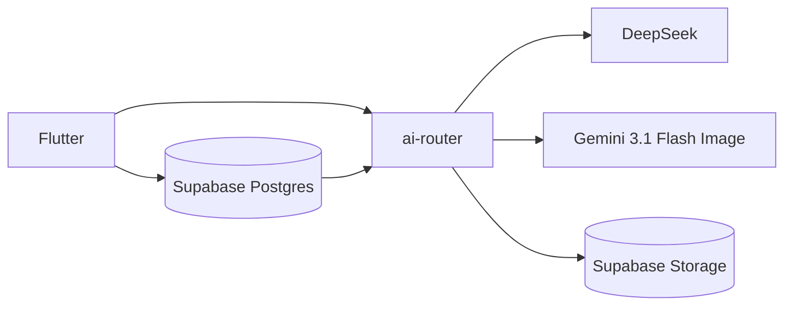

# AIFit — Atelier de moda con IA

AIFit convierte el armario real de una persona en un **grafo semántico de prendas** y genera looks personalizados con try-on virtual. No recomienda catálogo: trabaja con lo que ya tienes.

Este README documenta las **tecnologías**, cómo se **da contexto a los modelos** y se **comprimen las imágenes**, los **modelos de outfit**, y la **arquitectura / organización de carpetas**.

---

## Capturas de producto

App en [https://aifit-a7f6b.web.app](https://aifit-a7f6b.web.app)

<table>
  <tr>
    <td align="center" valign="top" width="50%">
      <p><strong>Armario</strong></p>
      
    </td>
    <td align="center" valign="top" width="50%">
      <p><strong>Perfil e identidad</strong></p>
      
    </td>
  </tr>
  <tr>
    <td align="center" valign="top" width="50%">
      <p><strong>Historial de try-on</strong></p>
      
    </td>
    <td align="center" valign="top" width="50%">
      <p><strong>Detalle de look</strong></p>
      
    </td>
  </tr>
  <tr>
    <td colspan="2" align="center">
      <p><strong>Atelier</strong></p>
      
    </td>
  </tr>
</table>

---

## Tecnologías

### Cliente

| Tecnología | Uso en AIFit |
|------------|----------------|
| **Flutter / Dart** | App multiplataforma (iOS, Android, Web). El cliente llama a Supabase para datos, Storage e IA. |
| **BLoC + flutter_bloc** | Estado por feature: `AuthBloc`, `WardrobeBloc`, `ChatBloc`, `OutfitGenerationBloc`, `SavedOutfitsBloc`. |
| **go_router** | Rutas, splash, onboarding y shell de navegación (Armario / Atelier / Perfil). |
| **google_fonts** | Identidad visual: *Cormorant Garamond* (editorial) + *Outfit* (UI). |
| **cached_network_image / Dio** | Carga de fotos de prendas, try-on e identidad. |
| **image + Dart `compute()`** | Compresión JPEG fuera del hilo de UI (en web se evita el isolate por el coste de copiar buffers). |
| **get_it / equatable** | Inyección ligera y comparación de estados. |

### Cloud

| Servicio | Rol |
|----------|-----|
| **Supabase Auth** | Sesión del usuario. |
| **Supabase Postgres** | Perfil, fotos, prendas y outfits guardados. |
| **Supabase Storage** | Fotos privadas de identidad y prendas; imágenes generadas. |
| **Supabase Edge Function `ai-router`** | Orquesta DeepSeek y Gemini con claves guardadas en el servidor. |

### IA externa

| Proveedor | Modelo | Dónde |
|-----------|--------|--------|
| DeepSeek | `deepseek-chat` | Composición de outfits con candidatos estructurados |
| Gemini | `gemini-3.1-flash-image` | Nueva foto del usuario con outfit, pose y escena |

---

## Cómo damos contexto a los modelos (y por qué funciona)

Ningún modelo ve “toda la app”. Cada etapa recibe **solo el contexto que necesita**, en el formato que mejor razona: texto estructurado, JSON de armario o bytes de imagen.

```
Foto de prenda  →  ai-router             →  metadata en Postgres
Prompt / intent →  filtro del armario    →  candidatos
Candidatos      →  DeepSeek (JSON)       →  3 looks
Fotos de identidad + fotos de cada prenda + escena → Gemini 3.1 Flash Image → nueva foto
```

### 1. Contexto del armario (semántica, no solo “camiseta azul”)

Al subir una prenda, Gemini analiza la foto con un prompt de estilista profesional (`WardrobeAnalysisPrompt`) y devuelve JSON v2:

- Tipo / subtipo, colores de paleta cerrada, estilo, temporada
- Peso visual, textura, silueta, estética
- Scores (formalidad, lujo, streetwear…)
- Vectores de ocasión y clima

Eso se guarda en Postgres. El ranking local (`WardrobeSearchAlgorithm` + `WardrobeMetadataScorer`) prefiltra el armario antes de componer outfits.

### 2. Contexto de intención (qué quiere vestir la persona)

El chat no improvisa el outfit. GPT acumula un `StylistIntentState` (ocasión, paleta, formalidad, vibe, restricciones). Cuando hay suficiente señal, se genera un `OutfitIntent` JSON (DeepSeek, temperatura 0.2). Si el chat ya trae intent, **se omite DeepSeek**.

Ese JSON se traduce a `OutfitSemanticTargets` y se inyecta en el prompt de composición.

### 3. Contexto visual para componer el look

`OutfitGeneratorService` envía a DeepSeek los candidatos estructurados (id, tipo, colores y estilo). La respuesta contiene tres outfits JSON. La UI muestra los looks antes de generar sus imágenes.

### 4. Contexto de identidad (que el try-on sea *tú*)

Cada imagen se genera como una fotografía nueva:

1. El usuario sube fotos claras de rostro y cuerpo (hasta 4 + 4).
2. El servidor elige hasta cuatro referencias de esa persona y vuelve a firmar sus URLs de Storage.
3. En la comparación temporal, el primer look usa Gemini 3.1 Flash Image, el segundo Seedream 5.0 Flash y el tercero Kling O3 Image. Cada proveedor recibe fotos individuales de la persona y las prendas; Seedream y Kling aceptan hasta diez referencias en total.
4. Los tres generan una foto vertical 3:4 a 2K. La pose y el fondo pueden cambiar; la identidad y los detalles pequeños dependen de la calidad de las referencias y del resultado de cada modelo.

La imagen base antigua ya no participa en esta generación y sus controles se retiraron del Perfil.

### Configuración del servidor

La función requiere `GEMINI_API_KEY` y, para los looks segundo y tercero, `FAL_KEY` como secretos de Supabase. Crea una clave de API en [fal.ai](https://fal.ai/dashboard/keys) y guárdala como `FAL_KEY` en Edge Functions → Secrets del proyecto Supabase. `GEMINI_IMAGE_SIZE` es opcional (`1K`, `2K` o `4K`; por defecto `2K`). Tras cambiar la función, desplegar con:

```sh
supabase functions deploy ai-router --project-ref cictlfpnohrnvfchtroa --no-verify-jwt --use-api
```

Las claves nunca van en el cliente Flutter. `FASHN_API_KEY`, `IMAGE_MODEL` e `IMAGE_PROVIDER` ya no controlan este flujo. Los tres looks generan sus imágenes automáticamente para compararlas en el mismo resultado.

---

## Compresión de imágenes (calidad vs. tokens vs. latencia)

Las fotos originales se guardan en Storage. Lo que viaja a los modelos se **preprocesa en el cliente** (`ImageCompressionUtil`) para no pagar tokens de visión con megapíxeles innecesarios.

| Payload | Ancho | JPEG | Para qué |
|---------|-------|------|----------|
| **Garment** | máx. **768 px** | calidad **82** | Análisis de prenda y composición multimodal. Suficiente para tela, color y silueta; recorta coste y latencia. |
| **Identity** | mín. **1024 px** (upscale si viene más chica) | calidad **93** | Cara y cuerpo: no se puede perder detalle de identidad. |
| **Raw** | sin tocar | — | Casos donde el original ya es el payload. |

Detalles de ingeniería:

- **Móvil/desktop:** `compute()` (isolate) para decode/resize/encode.
- **Web:** se evita el isolate (copiar `Uint8List` al worker jankea WASM); se cede un frame y se encodea en el isolate de UI.
- Concurrencia: 5 descargas en nativo, 2 en web (`ImagePipelineConfig`).
- Caché de sesión (`ImageByteCache`) para no re-descargar la misma prenda en un mismo generate.
- Tope de **12 imágenes** por request multimodal.

Resultado: el modelo ve prendas nítidas y un rostro fiel, sin mandar HEIC de 8 MB.

---

## Modelos que definen los outfits

| Fase | Motor | Resultado |
|------|-------|-----------|
| Conversación e intención | Chat y `OutfitIntent` | Ocasión, estilo, colores y pedido de escena |
| Filtro | `WardrobeSearchAlgorithm` | Candidatos del armario |
| Composición | DeepSeek `deepseek-chat` | Hasta tres outfits con IDs de prendas |
| Imagen | Gemini `gemini-3.1-flash-image` | Foto nueva con identidad, prendas, pose y fondo |

Los outfits se guardan en Supabase Postgres. Las imágenes generadas se guardan en Supabase Storage.

---

## Arquitectura



---

## Organización de carpetas

```
lib/
  main.dart                          # Bootstrap Supabase + BLoCs + tema Atelier
  core/
    theme/                           # Color, tipografía, ThemeData
    widgets/                         # Shell, nav, cards, empty states, router
    services/                        # Supabase, Storage y gateway de IA
    utils/                           # Compresión, collage, pool, config de pipeline
    constants/                       # IdentityConsistencyPrompt
    l10n/                            # Copy en español
    platform/                        # Imagen web vs IO
  features/
    auth/          presentation + data     Login, welcome, photos de onboarding
    wardrobe/      presentation/domain/data  Closet, análisis de prenda
    stylist/       presentation/domain/data/services  Chat atelier
    outfit/        presentation/domain/data/services  Intent, ranking, generate, try-on
    profile/       presentation/domain/data/services  Fotos y perfil de identidad
    simulation/    presentation                  Resultado lookbook

supabase/functions/ai-router/        # Orquestación de IA en producción
docs/images/                         # Capturas de producto
web/                                 # index.html, manifest PWA
android/ ios/                        # Hosts nativos
```

Tokens de diseño Atelier (`lib/core/theme/`):

- Lienzo pergamino `#F3EEE6`, tinta espresso, burgundy `#5C2433`, champagne `#C4A574`
- Display: Cormorant Garamond · UI: Outfit

---

## Desarrollo local

```bash
flutter pub get
flutter run -d chrome
# o
flutter run
```

Para depurar en el iPhone físico configurado en `.vscode/launch.json`:

```bash
./scripts/debug_iphone.py
```

Detén la sesión con `Ctrl+C`; Flutter conserva hot reload (`r`) y hot restart (`R`) en la terminal.

La app usa la URL y clave publicable de Supabase en `--dart-define` (ver `.vscode/launch.example.json`). Las claves de Gemini y DeepSeek se configuran como secretos de Supabase para `ai-router`.

## Deploy web

```bash
flutter build web --release
firebase deploy --only hosting
```

Hosting sirve `build/web` con rewrite SPA a `index.html`.

**Producción:** [https://aifit-a7f6b.web.app](https://aifit-a7f6b.web.app)
